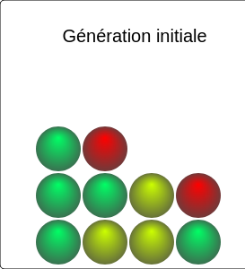

# La dérive génétique

## **questions :**

1. Proposer une hypothèse expliquant que dans la famille Fugate on arrive, après plusieurs générations, à 100% de porteurs de méthémoglobine.
2. **Protocole expérimental** : Taper dans un moteur de recherche « dérive génétique Cosentino » et se rendre sur le premier lien  
__*note*__ : dans ce logiciel, 1 couleur = 1 allèle (c’est à dire une version de gène)
**Rappel vocabulaire** : un exemple de gène « couleur des yeux ». Les exemples d’allèles correspondants à ce gène sont :
    - allèle A = bleu  
    - allèle B = vert  
    - allèle C = marron.

- __**Paramétrage**__ :  
  - Fixer les paramètres de la première modélisation : 10 individus et 3 allèles différents pour un même gène. Ne pas autoriser les mutations  
  - Cliquer sur Démarrer  
- __**Lancement**__ :  
  - Cliquer sur **Tout Tirer**, vous obtenez alors la fréquence des allèles à la première génération après transmission par reproduction sexuée.  
   Recommencer puis Tout Tirer, vous obtenez alors la fréquence des allèles à la deuxième génération.  
   Recommencer jusqu’à la génération 5.  
       ***Comment évoluent les différents allèles au cours des générations ? Comparer avec les résultats des autres membres de votre groupe.***  
  - **Réinitialiser** puis fixer les paramètres pour une deuxième modélisation : 50 individus et toujours 3 allèles différents et jusqu’à la génération 5.  
       ***Comment évoluent les différents allèles au cours des générations ? Comparer avec les résultats des autres membres de votre groupe.***  
  - **Réinitialiser** puis fixer les paramètres pour une troisième modélisation : 100 individus et toujours 3 allèles différents et jusqu’à la génération 5.  
       ***Comment évoluent les différents allèles au cours des générations ? Comparer avec les résultats des autres membres de votre groupe.***  
  - **Conclure**

## **réponses :**

1. L’allèle de la méthémoglobine est présent en proportion très faible dans la population initiale (France).  
    Dans le couple formé par les parents Fugate, on passe à 50% d’individus ayant cet allèle.  
    On a alors une modification de la fréquence allélique due à l’isolement de la population.  
    On peut supposer qu’au fil des génération, l’isolement d’une population conduit à la modification des proportions d’allèles dans une population.
2. première génération:
   - 
